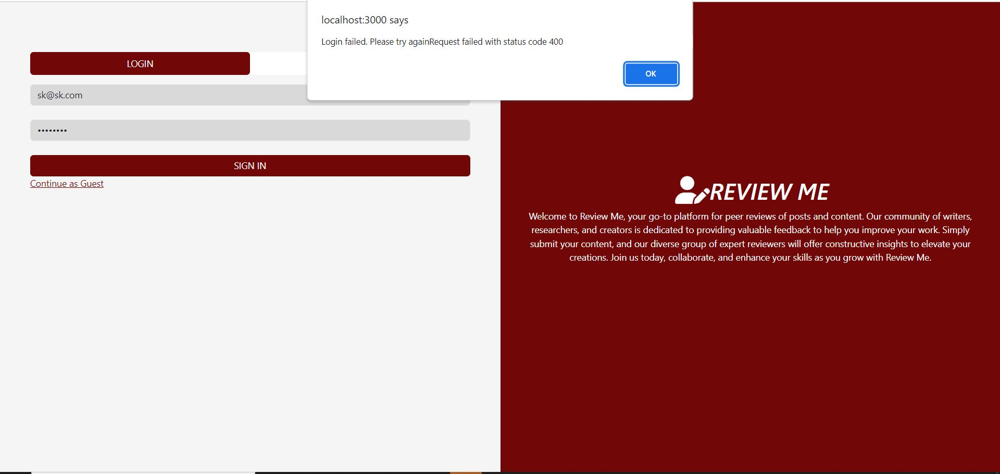
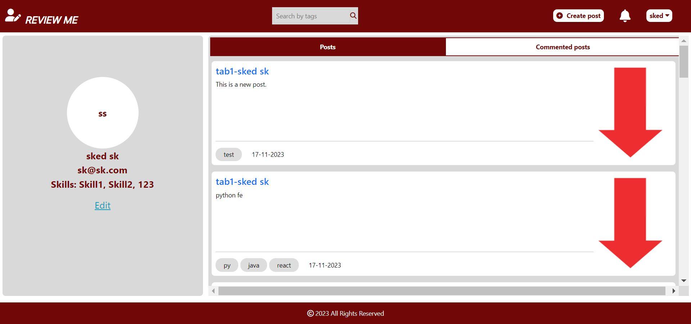
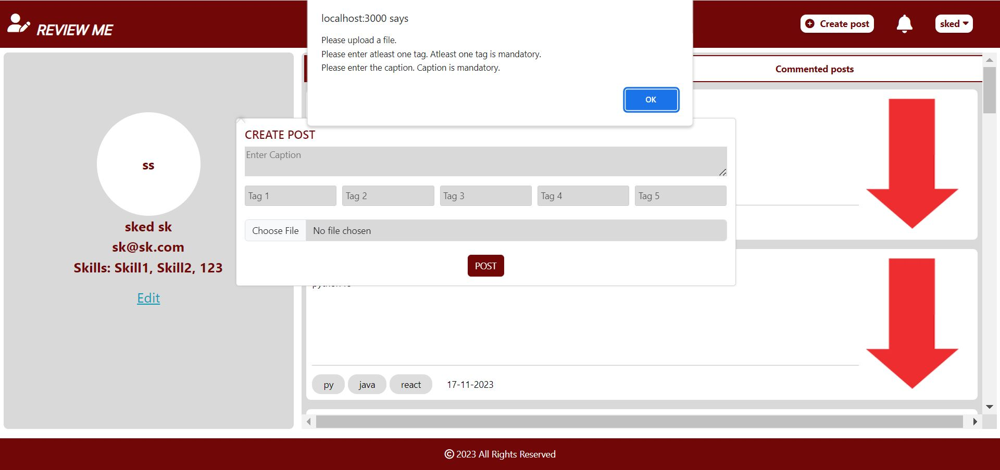
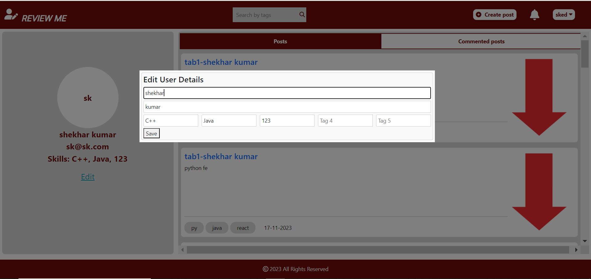
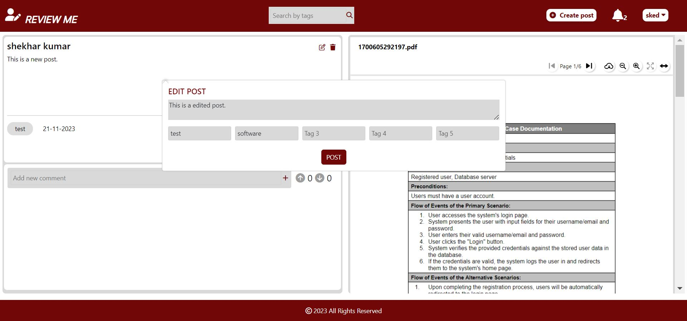
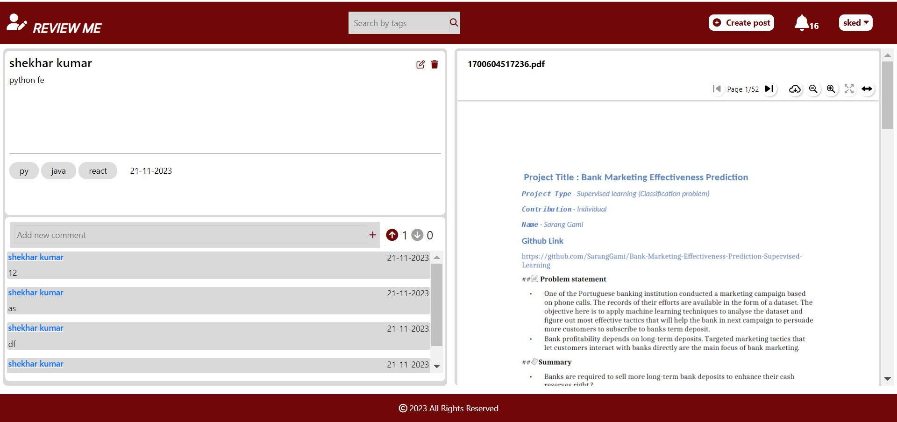
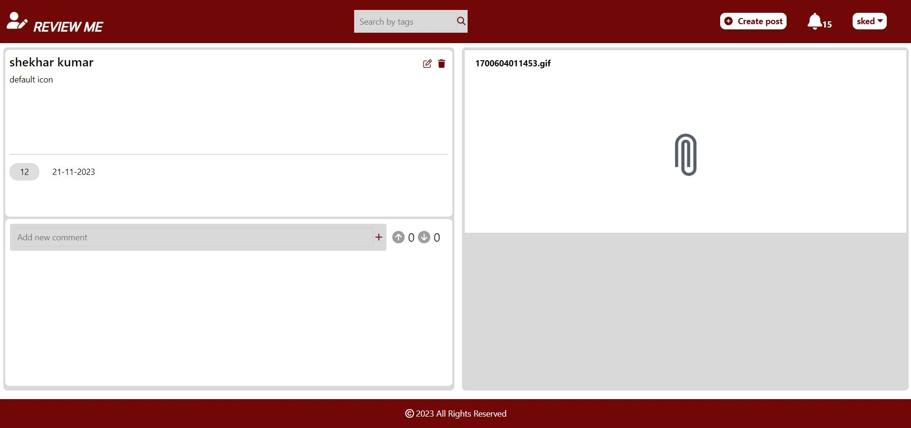
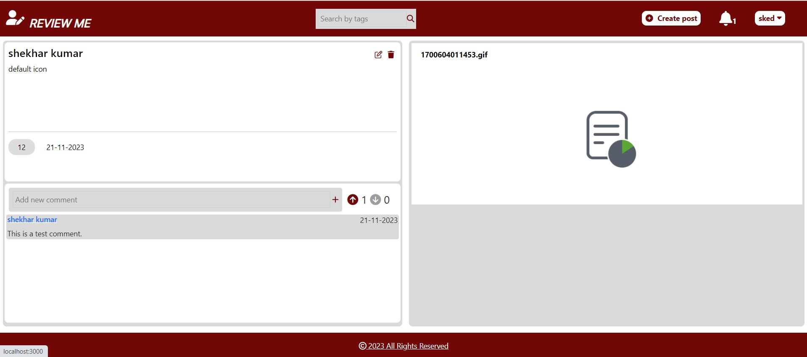
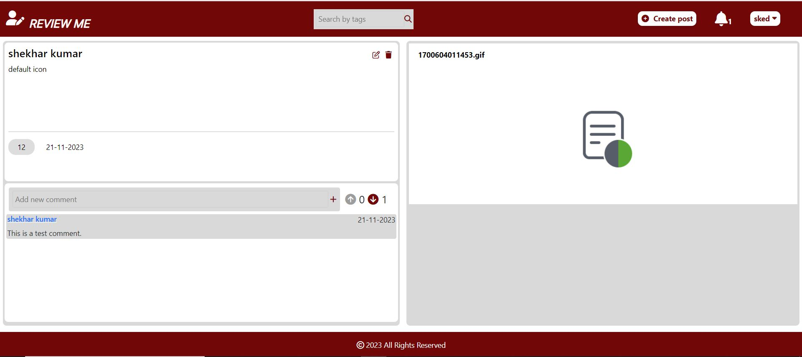

# Runtime_Terror
Runtime_Terror

# Acceptance Test report - ReviewMe

## Test case: User Registration

### Description: 
Verify user registration functionality.

### Test Steps:
 Input valid first name, last name, email, password, and at least one skill tag.
Click on the "SIGN UP" button.
Check if registration is successful.
Check if the user is redirected to the home page after successful registration.

### Expected result:
Registration should succeed when valid details are provided.
The user should be redirected to the home page after successful registration.

### Actual result:
The user is successfully registered. 
The user is redirected to the home page.

### Status: 
Pass

## Test case: Error scenario in User Registration

### Description:
Validate error handling during user registration when invalid or incomplete information is provided.

### Test Steps:
Leave the first name field empty.
Leave the last name field empty.
Enter an invalid email format.
Enter a password less than 6 characters.
Leave the skill tags empty.
Enter a password in the "Password" field and a different value in the "Confirm Password" field.
Click on the "SIGN UP" button.
Check for error messages/alerts displayed.

### Expected result:
Error messages should be displayed for each field that has invalid/incomplete information.
An error message should alert users about mismatched passwords if the "Password" and "Confirm Password" fields don’t match.
The registration process should not proceed with incomplete or incorrect information.

### Actual result:
The error message is displayed and the registration process is not proceeding.

### Status:
Pass

## Test case: User Login
Description: Validate the user login functionality with valid credentials.
### Test Steps:
 Open the login page of the application.
Enter a valid registered email address in the "Email address" field.
Enter a valid password in the "Password" field.
Click on the "SIGN IN" button.
Verify if the user is successfully logged in.
Check if the user is redirected to the home page after successful login.
### Expected result:
 Successful login should occur when valid credentials are entered.
After successful login, the user should be redirected to the home page.
Actual result:
 The user is successfully logged-in. 
The user is redirected to the home page.

### Status:
Pass
 
## Test case: Error Scenario in User Login
 
### Description: 
Validate error handling during user login with invalid credentials.
## Test Steps:

Open the login page of the application.
Enter an invalid/unregistered email address in the "Email address" field.
Enter an incorrect password in the "Password" field.
Click on the "SIGN IN" button.
Verify if appropriate error messages/alerts are displayed for invalid credentials.
### Expected result:
 Error messages should be displayed for invalid/unregistered email addresses and incorrect passwords.
Users should not be allowed to log in with incorrect credentials.
The login process should not proceed with invalid login details.
### Actual result:
 The error message is displayed and the loginprocess is not proceeding.

### Status:
Pass

 
## Test case: Creating a post when the user is logged in
### Description:
Validate the functionality of creating a post with valid input.
### Test Steps:
 Input a caption for the post.
Add at least one tag for the post.
Upload a file.
Click on the "POST" button.
Verify if the post is successfully uploaded.
### Expected result:
The post should be successfully uploaded when valid content, including a caption, the file and at least one tag, is provided.
### Actual result:
 The post is created.

 
 

### Status: 
Pass

## Test case: Error Handling for Mandatory Fields in Create Post
### Description: 
Verify error handling for missing mandatory fields during post creation.
### Test Steps:
Leave the caption field empty.
Leave all tag fields empty.
The file should not be uploaded.
Click on the "POST" button.
Check for error messages/alerts displayed.
### Expected result:
 Error messages should be displayed for missing mandatory fields (caption, at least one tag and a file).
The post should not be created with incomplete or missing mandatory information.
### Actual result:

 
### Status: 
Pass

## Test case: Edit Profile Details
### Description: 
Validate the functionality of editing user profile details.

### Test Steps:
Load the Edit Profile Details component with existing user details.
Modify the first name, last name, and tags (tag1 - tag5) with updated valid information.
Click on the "Save" button to save the changes.
Verify if the component's state reflects the changes made after saving.
### Expected result:
The user profile details should be edited.
### Actual result:

### Status:
Pass

## Test case: Edit Post functionality
### Description: 
Validate the functionality of the "Edit" button.
### Test Steps:
Click on the edit button and make the relevant changes in the post.
Click on ‘POST’ button.
### Expected result:
The post should be edited.
### Actual result:

### Status:
Pass

## Test case: Delete Post
### Description: 
Validate the functionality of the "Delete" button.
### Test Steps: 
Click on the delete icon to delete the post.
### Expected result:
Verify that the post is deleted successfully. 
### Actual result:
The post is deleted successfully.
### Status:
Pass

## Test case: Notifications
### Description: 
Validate the functionality of user notifications.
### Test Steps:
After logging in to the platform, check that  the notifications are present. 
### Expected result:
The notifications should be visible.
### Actual result:
The notifications with the count are visible.

### Status:
Pass

## Test case: Comments on a post
### Description: 
User enters a new comment in the input field.
### Test Steps: 
Enter a new comment in the input field.
Click on the plus icon to submit the comment.
### Expected result:
The new comment should be added to the comments section.
### Actual result:

### Status: 
Pass

## Test case: Post Upvote
### Description: 
User upvotes a post.
### Test Steps: 
Click on the upvote icon for a post.
### Expected result: 
The upvote count should increase, and the style of the upvote icon should change to indicate it has been upvoted.
### Actual result:

### Status:
Pass

## Test case: Post Downvote
### Description: 
User downvotes a post.
### Test Steps: 
Click on the downvote icon for a post.
Expected result: The count should decrease, and the style of the icon should change to indicate it has been downvoted.
### Actual result:

### Status:
Pass

## Test case: Continue as Guest Functionality
### Description:
User clicks on "Continue as Guest."
### Test Steps:
Click on the "Continue as Guest" button.
### Expected result: 
The application allows the user to access limited features without requiring a full login. The user should be directed to the main interface with restricted capabilities.
### Actual result:

### Status: 
Pass

## Test case: Search functionality
### Description: 
Testing the search functionality.
### Test Steps: 
Type the hashtag in the search box and click on search icon.
### Expected result: 
The post with the searched hashtag should be displayed.

### Actual result:

### Status:
Pass

 

 

 

